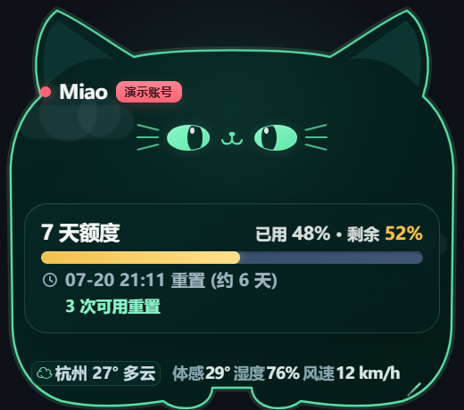
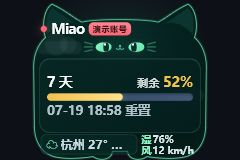

# CodexPet · Miao

简体中文 · [English](README.md)

[](https://github.com/shamikabeike/CodexPet/actions/workflows/ci.yml)
[](LICENSE)
[](#安装)

Miao 是一只开源的 Windows 桌面猫咪：它只保留猫头形额度面板，显示本机 Codex 额度与可选天气信息，会自然眨眼、偶尔摇耳，并能在 25%–150% 尺寸下保持可读。项目不包含任何全身宠物动画资产。

## 当前界面

<table>
  <tr>
    <td align="center"><br><sub>简体中文 · 100% 展示</sub></td>
    <td align="center"><br><sub>English · 100% 展示</sub></td>
  </tr>
</table>

<p align="center"><br><sub>25%–36% 使用的紧凑布局</sub></p>

以上截图由当前 `main` 分支渲染，并明确使用演示数据；安装后的 Electron 窗口会读取本机 Codex 事件，并把“演示账号”替换为检测到的会员状态。为方便在文档中看清细节，截图采用 100% 展示，应用实际默认窗口为 `260×230`（50%）。

> Miao 是独立的 Electron 桌面伴侣，不是 OpenAI 官方产品、Codex 官方插件，也不会修改 Codex 桌面软件。

## 功能

- 只显示最新本地 Codex 事件中实际存在的额度周期。因此当前截图只有一条 7 天额度，不伪造第二条占位；以后周期增减也按事件动态适配。
- 显示已用/剩余百分比、重置时间、约剩余时长和账号会员状态。
- 以剩余额度显示警示色：60%–100% 绿色、30%–59% 黄色、低于 30% 红色。
- Codex 写入新额度事件时自动同步，并保留 60 秒轮询兜底。
- 始终只有一个猫头额度面板，没有全身精灵图、第二宠物窗口、刷新按钮或关闭按钮。
- 猫眼自然眨动、猫耳低频轻摇，并遵守系统“减少动态效果”设置。
- 可选显示城市天气、气温、体感温度、湿度、风速和轻量动态天气图层。
- 默认以设计尺寸的 50% 启动，可在 25%–150% 间等比缩放；最小尺寸使用单独的大字排版。
- 首次启动跟随系统语言，可在天气设置弹层中手动切换简体中文或英语，选择会保存在本机。
- 通过系统托盘显示、隐藏、置顶或退出 Miao。

## 隐私与数据边界

Miao 没有自建云端服务，也不需要 OpenAI API Key。

Electron 主进程只读取 `~/.codex/sessions` 和 `~/.codex/archived_sessions` 中最近 `rollout-*.jsonl` 文件的尾部，提取结构化 `payload.rate_limits`，再把归一化后的额度数字交给沙箱渲染进程。它**不会**读取 `auth.json`、提示词、回答或工具输出，也不会上传 Codex 会话内容。

天气是可选功能。Miao 不使用 IP、浏览器或 Windows 定位；只有用户主动保存城市后，才会访问 [Open-Meteo](https://open-meteo.com/)。城市与坐标仅保存在 Electron 本地 `userData` 目录。Open-Meteo 数据采用 CC BY 4.0 许可，其免费接口主要面向非商业使用。

完整边界见[安全策略](SECURITY.md)和[技术架构](docs/ARCHITECTURE.md)。

## 安装

当前 Windows 正式版为 [Miao v0.1.0](https://github.com/shamikabeike/CodexPet/releases/tag/v0.1.0)：

- [`Miao-0.1.0-x64-nsis.exe`](https://github.com/shamikabeike/CodexPet/releases/download/v0.1.0/Miao-0.1.0-x64-nsis.exe)：安装版；
- [`Miao-0.1.0-x64-portable.exe`](https://github.com/shamikabeike/CodexPet/releases/download/v0.1.0/Miao-0.1.0-x64-portable.exe)：便携版；
- [`SHA256SUMS.txt`](https://github.com/shamikabeike/CodexPet/releases/download/v0.1.0/SHA256SUMS.txt)：SHA-256 校验清单。

社区开源构建没有商业代码签名，Windows SmartScreen 可能提示“未知发布者”。请确认文件来自本仓库 Releases 页面。

首次启动后：

1. 拖动猫耳或标题区域调整位置。
2. 拖动右下角缩放手柄，在 25%–150% 范围内选择尺寸。
3. 点击天气区域设置城市或切换界面语言。
4. 在系统托盘中显示、隐藏、置顶或退出 Miao。

## 本地开发

要求：Windows 10/11、Node.js 24 和 npm。

```powershell
git clone https://github.com/shamikabeike/CodexPet.git
cd CodexPet
npm.cmd ci
npm.cmd run dev
```

浏览器直接打开 Vite 页面时会使用明确标记的演示额度；只有 Electron 窗口能读取本机 Codex 额度事件。

常用命令：

```powershell
npm.cmd run typecheck   # TypeScript 检查
npm.cmd test            # Vitest 单元测试
npm.cmd run build       # 生产构建
npm.cmd run verify      # 类型检查 + 测试 + 生产构建
npm.cmd run package:win # NSIS 安装包 + 便携版
```

## 项目结构

```text
electron/                 Electron 主进程、preload、额度与天气适配器
src/                      React UI、双语、动画和共享契约
docs/screenshots/         由当前渲染器生成的界面截图
docs/design/              UI 规格
docs/ARCHITECTURE*.md     中英文架构说明
.github/workflows/        CI 与 Windows Release 自动化
```

## 已知边界

- 当前桌面发行目标仅为 Windows。
- Codex 本地 rollout 事件不是本项目控制的公开协议，上游格式变化时可能需要更新适配器。
- 本机尚无合法额度事件时，Miao 会明确显示演示模式。
- Open-Meteo 免费接口不提供商业可用性保证。
- 本项目与 OpenAI、Codex 没有官方集成协议。

## 参与项目

提交 Pull Request 或安全报告前，请阅读 [CONTRIBUTING.md](CONTRIBUTING.md)、[SECURITY.md](SECURITY.md) 与 [CODE_OF_CONDUCT.md](CODE_OF_CONDUCT.md)。

## 许可证与商标

项目代码和自有素材采用 [MIT License](LICENSE)。

Miao 与 CodexPet 是社区开源项目，与 OpenAI 无隶属或官方背书关系。“Codex”“OpenAI”及相关产品名称归其各自权利人所有。
