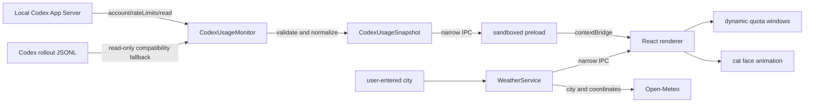

# Architecture

[中文版](ARCHITECTURE.md) · English

Miao is an Electron + React tray/menu-bar application for Windows and macOS with one cat-head-shaped usage window. It reads local Codex rate-limit events, renders optional weather, and adds only local eye and ear animation. It has no full-body pet or second window mode.

`docs/screenshots/` is the visual source of truth. Its Chinese, English, and compact images are generated from the current `main` renderer with explicitly labeled demo data; earlier concept art is not part of the product implementation.

## Data flow

## Local usage adapter

`electron/usage/codexAppServer.ts` is the primary adapter. It starts the local `codex app-server` (`codex.exe` on Windows), initializes the connection, and calls only `account/rateLimits/read`; it never calls `account/rateLimitResetCredit/consume`.

- The App Server response is reduced to used/remaining percentages, window duration, reset time, plan, available reset count, and observation time. Credit IDs, descriptions, and expiry metadata are discarded.
- Windows discovery covers Codex desktop directories, `CODEX_HOME` helpers, and `PATH`. macOS discovery also checks the Codex and current ChatGPT app bundles under `/Applications` and `~/Applications` for `Contents/Resources/codex`.
- Miao does not read `auth.json`. The local Codex child process reuses the user's existing login and talks to OpenAI; Miao handles only its structured rate-limit response.
- If a compatible App Server cannot be found or queried, `electron/usage/codexUsage.ts` falls back to a limited tail scan of recent `rollout-*.jsonl` files under `CODEX_HOME` (default `~/.codex`).
- The fallback reads at most 4 MiB per file, parses optional primary and secondary windows, and never hard-codes a five-hour or seven-day slot in the renderer.
- Old App Server and rollout responses may not contain a reset count; the UI then shows `—`. If neither source yields a valid window, Miao returns an explicitly labeled demo snapshot.

Both sources stay isolated behind tested adapters and a shared renderer contract.

## Weather adapter

`electron/weather/weather.ts` remains idle until a user saves a city. It then uses Open-Meteo geocoding and current-weather endpoints, stores the resolved city, coordinates, and timezone in `userData/weather-location.json`, and refreshes about every 30 minutes.

The renderer receives only a structured weather snapshot: temperature, feels-like temperature, humidity, wind, WMO condition, daylight state, and observation time. No Codex usage or session data is included in weather requests.

## Process boundary

| Layer | Allowed | Explicitly disallowed |
| --- | --- | --- |
| Electron main | Call the local Codex read-only usage method, read fallback events, watch files, manage window/tray, and query weather after setup | Read authentication files, consume reset credits, or send Codex data to weather services |
| Preload | Expose fixed typed IPC methods | Arbitrary IPC, Node globals, filesystem paths |
| React renderer | Render normalized snapshots and local interactions | Filesystem access, command execution, arbitrary navigation |

Important Electron settings include `contextIsolation: true`, `nodeIntegration: false`, `sandbox: true`, denied permission requests, denied new windows, and blocked navigation.

## Refresh strategy

1. Read usage and available reset count through Codex App Server at startup.
2. Watch Codex session directories and debounce JSONL changes by 450 ms; use those events as fallback when the App Server query fails.
3. Query once per minute to stay close to Codex changes and cover missed filesystem events.
4. Push normalized snapshots to the renderer; there is no manual refresh control in the panel.

## Window and responsive layout

The design coordinate space is `520×460`. Miao starts at `260×230` (50%), stays transparent and frameless, and resizes proportionally from 25% to 150% through a constrained IPC call. The ears and title area drag the window; weather controls and the lower-right resize handle are interactive no-drag regions.

At 36% and below, the renderer switches to a dedicated compact layout with larger internal type and thicker progress bars instead of mechanically shrinking the full layout. The outer cat silhouette does not change. A missing five-hour quota does not leave an empty placeholder.

## Localization and motion

The renderer selects Simplified Chinese for `zh*` system locales and English for other locales on first launch. A persisted manual selector lives inside the weather settings popover. Visible quota, membership, duration, weather, accessibility, resize, and document strings share the same locale source. The tray/menu-bar menu follows the operating-system locale and loads a packaged transparent cat-head icon instead of converting SVG at runtime. Miao hides its Dock icon on macOS and stays available from the menu bar.

Blinking is randomly scheduled every 3.8–9 seconds, with an occasional double blink. Ear twitches occur every 6.5–14 seconds. Weather animation stays clipped to the cat silhouette. `prefers-reduced-motion` disables random scheduling and minimizes CSS movement.

## Build and release

- Vite and `vite-plugin-electron` build the renderer, Electron main process, and preload.
- Vitest covers usage parsing, weather normalization, formatting, localization, quota health, and window sizing.
- `electron-builder` creates x64 NSIS and portable Windows executables plus x64 and arm64 macOS DMGs.
- A `v*` tag builds on native Windows x64, macOS Intel, and macOS Apple Silicon GitHub runners. The workflow checks each macOS executable architecture before publishing all assets and one SHA-256 manifest.
- Community builds are unsigned and not Apple-notarized, so Windows SmartScreen or macOS Gatekeeper may show a source warning.
