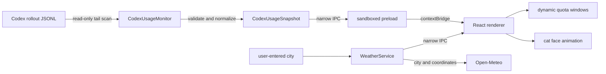

# Architecture

[中文版](ARCHITECTURE.md) · English

Miao is an Electron + React Windows tray application with one cat-head-shaped usage window. It reads local Codex rate-limit events, renders optional weather, and adds only local eye and ear animation. It has no full-body pet or second window mode.

`docs/screenshots/` is the visual source of truth. Its Chinese, English, and compact images are generated from the current `main` renderer with explicitly labeled demo data; earlier concept art is not part of the product implementation.

## Data flow

## Local usage adapter

`electron/usage/codexUsage.ts` resolves `CODEX_HOME`, or defaults to `~/.codex`, and scans a limited number of recently modified `rollout-*.jsonl` files in `sessions/` and `archived_sessions/`.

- It reads at most the last 4 MiB of each candidate file.
- It parses optional `payload.rate_limits.primary` and `secondary` objects, then deduplicates and sorts them by `window_minutes`.
- It does not hard-code a five-hour or seven-day slot in the renderer.
- Its output contains only used/remaining percentages, window duration, reset time, plan, model, and observation time.
- Bad lines, file rotation, or one unreadable session do not block the other candidates.
- When no valid event exists, it returns an explicitly labeled demo snapshot.

The local rollout shape is not a public protocol controlled by this repository, so parsing stays isolated behind a tested adapter and shared contract.

## Weather adapter

`electron/weather/weather.ts` remains idle until a user saves a city. It then uses Open-Meteo geocoding and current-weather endpoints, stores the resolved city, coordinates, and timezone in `userData/weather-location.json`, and refreshes about every 30 minutes.

The renderer receives only a structured weather snapshot: temperature, feels-like temperature, humidity, wind, WMO condition, daylight state, and observation time. No Codex usage or session data is included in weather requests.

## Process boundary

| Layer | Allowed | Explicitly disallowed |
| --- | --- | --- |
| Electron main | Read usage events, watch files, manage window/tray, query weather after user setup | Read authentication files; send Codex data to weather services |
| Preload | Expose fixed typed IPC methods | Arbitrary IPC, Node globals, filesystem paths |
| React renderer | Render normalized snapshots and local interactions | Filesystem access, command execution, arbitrary navigation |

Important Electron settings include `contextIsolation: true`, `nodeIntegration: false`, `sandbox: true`, denied permission requests, denied new windows, and blocked navigation.

## Refresh strategy

1. Read the latest snapshot at startup.
2. Watch Codex session directories and debounce JSONL changes by 450 ms.
3. Poll once per minute as a fallback for unavailable or missed filesystem events.
4. Push normalized snapshots to the renderer; there is no manual refresh control in the panel.

## Window and responsive layout

The design coordinate space is `520×460`. Miao starts at `260×230` (50%), stays transparent and frameless, and resizes proportionally from 25% to 150% through a constrained IPC call. The ears and title area drag the window; weather controls and the lower-right resize handle are interactive no-drag regions.

At 36% and below, the renderer switches to a dedicated compact layout with larger internal type and thicker progress bars instead of mechanically shrinking the full layout. The outer cat silhouette does not change. A missing five-hour quota does not leave an empty placeholder.

## Localization and motion

The renderer selects Simplified Chinese for `zh*` system locales and English for other locales on first launch. A persisted manual selector lives inside the weather settings popover. Visible quota, membership, duration, weather, accessibility, resize, and document strings share the same locale source. The tray follows the Windows application locale and loads a packaged multi-size transparent cat-head icon instead of converting SVG at runtime.

Blinking is randomly scheduled every 3.8–9 seconds, with an occasional double blink. Ear twitches occur every 6.5–14 seconds. Weather animation stays clipped to the cat silhouette. `prefers-reduced-motion` disables random scheduling and minimizes CSS movement.

## Build and release

- Vite and `vite-plugin-electron` build the renderer, Electron main process, and preload.
- Vitest covers usage parsing, weather normalization, formatting, localization, quota health, and window sizing.
- `electron-builder` creates x64 NSIS and portable Windows executables.
- GitHub Actions runs `npm run verify` on pushes and pull requests; `v*` tags build GitHub Releases.
- Community builds are currently unsigned and may show a Windows SmartScreen warning.
