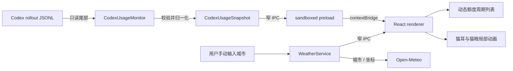

# 技术架构

中文版 · [English](ARCHITECTURE.en.md)

Miao 是一个 Electron + React Windows 常驻面板。它只显示猫头形额度窗口，读取本机 Codex 额度事件，并以低频摇耳、自然眨眼提供轻量“宠物感”；不包含独立全身宠物或第二种窗口形态。

## 数据流

### 本地额度适配器

入口位于 `electron/usage/codexUsage.ts`。

- 根目录来自 `CODEX_HOME`，未设置时使用用户目录下的 `.codex`。
- 只扫描 `sessions/` 与 `archived_sessions/` 中最近修改的少量 `rollout-*.jsonl`。
- 单文件最多读取尾部 4 MiB，避免把长会话整体载入内存。
- 分别解析可选的 `payload.rate_limits.primary` 与 `secondary`，再按 `window_minutes` 去重、排序；不把字段名硬编码为 5 小时或 7 天。
- 输出仅包含已用/剩余百分比、窗口分钟数、重置时间、套餐、模型和观察时间。
- 任何坏行、文件轮换或单个会话损坏都不会阻断其他候选文件。
- 没找到合法事件时返回明确标记的 `demo` 快照，不冒充真实数据。

本地会话格式不是项目控制的公共协议，因此解析逻辑被隔离在一个模块和一组契约测试中；上游字段变化时不需要改 UI。

### 天气适配器

入口位于 `electron/weather/weather.ts`。用户首次点击天气区域并保存城市后，主进程调用 Open-Meteo 地理编码接口，把规范化城市、经纬度和时区保存在 `userData/weather-location.json`；随后每 30 分钟读取一次当前气温、体感温度、相对湿度、风速、WMO 天气码和昼夜状态。渲染层只接收结构化天气快照，并把天气码映射为晴、云、雾、雨、雪、雷雨或未知状态。未设置城市时不发起任何天气请求。

## 进程边界

| 层 | 能力 | 明确禁止 |
| --- | --- | --- |
| Electron 主进程 | 读取额度事件、监听文件变化、管理窗口与托盘、按用户设置查询天气 | 读取认证文件、向天气服务发送 Codex 数据 |
| Preload | 暴露固定 IPC 方法 | 任意 IPC、Node 全局对象、文件路径 |
| React 渲染进程 | 展示结构化快照、处理动画与交互 | 文件系统、命令执行、任意导航 |

关键安全设置：`contextIsolation: true`、`nodeIntegration: false`、`sandbox: true`、拒绝新窗口、拒绝权限请求并阻止页面导航。

## 刷新策略

1. 启动时读取一次最新快照。
2. Windows `fs.watch` 递归监听会话目录，对 JSONL 变化做 450ms 防抖。
3. 每 60 秒轮询一次，作为文件监听不可用或漏事件时的兜底。
4. UI 不提供手动刷新按钮；渲染层直接订阅主进程发布的最新结构化快照。

## 窗口形态

窗口使用 `520×460` 作为设计坐标，默认以 50% 的 `260×230` 启动：透明、无系统边框、默认置顶。猫耳与标题栏可拖动；天气入口与右下角缩放手柄属于不可拖动的交互区域。缩放手柄把鼠标位移投影到固定宽高比，并通过受限 IPC 调用 `BrowserWindow.setContentSize`，允许在 25%–150% 范围内等比缩放。透明窗口保持 `resizable: false`，不依赖各平台表现不一致的系统原生边框缩放。宠物窗口不提供刷新或关闭按钮，显示、隐藏与退出由系统托盘菜单统一管理。

渲染层在缩放比例不高于 36% 时切换到独立紧凑布局，而不是继续机械缩小完整面板。紧凑布局使用一半宽高的内部设计坐标再放大两倍，因此在 25% 的 `130×115` 实际窗口中，主文字仍约为 10px、按钮约为 15px、进度条约为 5.5px；猫头 SVG 轮廓、天气图层和窗口尺寸保持不变。额度恢复为两条时会压缩说明文字并隐藏中部猫脸，为两条进度信息让出空间。

## 局部动画

| 动画 | 调度 | 实现 |
| --- | --- | --- |
| 眨眼 | 每 3.8–9 秒随机触发；24% 概率连续眨两次 | React 状态切换眼睛 `scaleY`，单次闭眼约 145ms |
| 摇耳 | 每 6.5–14 秒随机触发 | SVG 外轮廓在 520ms 内轻微变形，内耳同步做小幅旋转 |
| 额度同步 | Codex 写入新的额度事件时 | 进度条在新值到达后平滑过渡 |
| 天气 | 按当前 WMO 天气码；约 30 分钟刷新 | 裁剪在猫形内部的 CSS 云层、雨雪粒子、日月或星点 |

系统开启“减少动态效果”时，随机调度不启动，CSS 动画与过渡缩短到近乎静止。

## 双语界面

首次启动时，渲染进程把 `zh*` 系统语言映射为简体中文，其余语言映射为英语；用户也可在天气设置弹层中手动切换，选择保存在本机 `localStorage`。额度、会员状态、倒计时、天气、辅助阅读文本、缩放提示与文档标题共用同一语言源。系统托盘跟随 Windows 应用语言。

## 构建与发布

- Vite 构建 React 渲染层，并由 `vite-plugin-electron` 构建主进程与 preload。
- Vitest 覆盖额度解析与格式化。
- `electron-builder` 生成 Windows NSIS 安装包和便携版。
- GitHub Actions 在每个 PR 上执行类型检查、测试和构建；`v*` 标签触发 Windows Release。
- 当前开源发行包不做商业代码签名，Windows SmartScreen 可能显示未知发布者提示。
